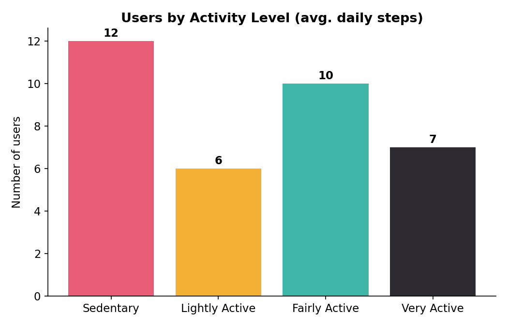
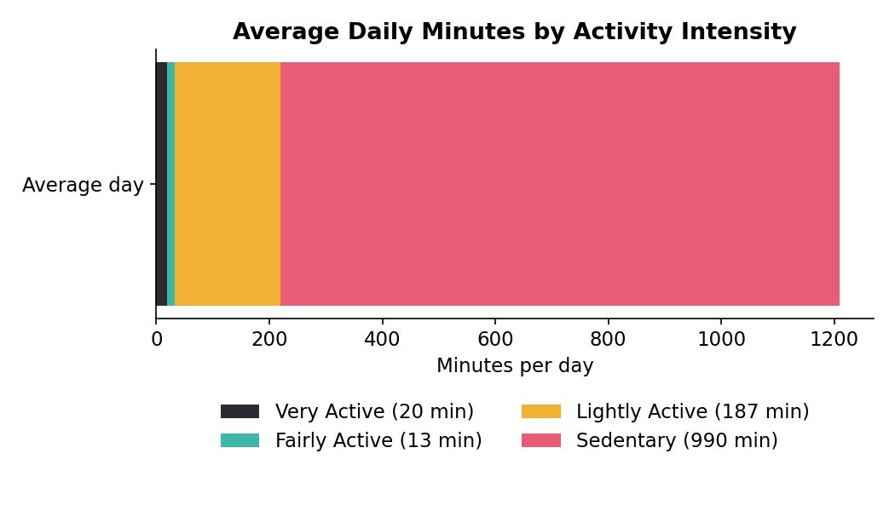
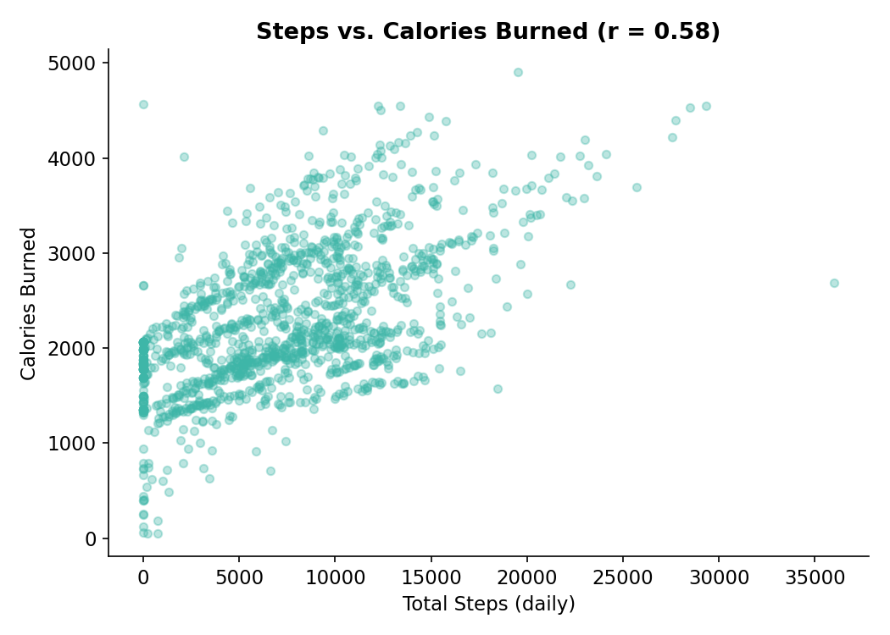
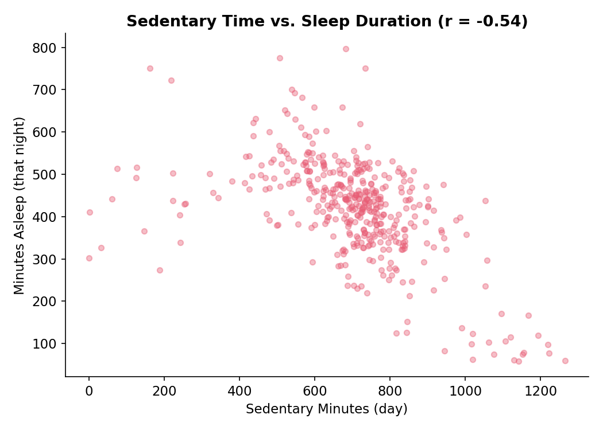
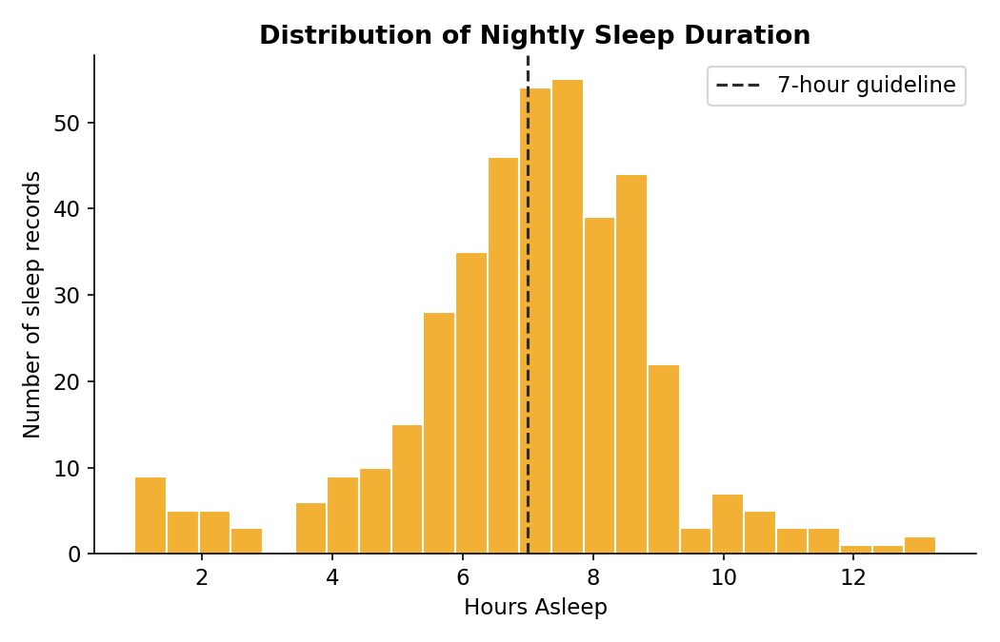
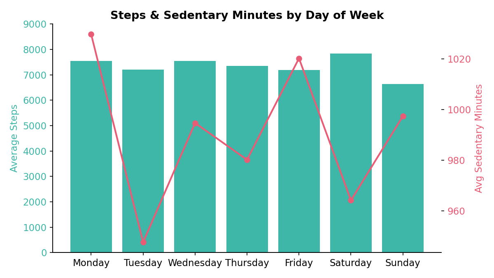
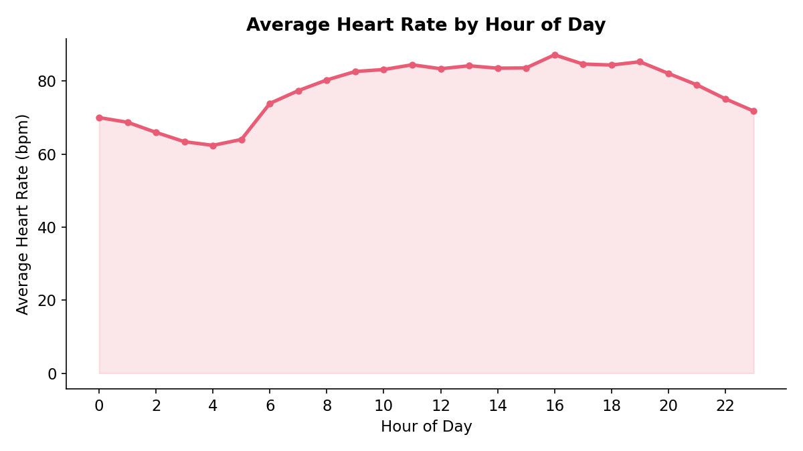
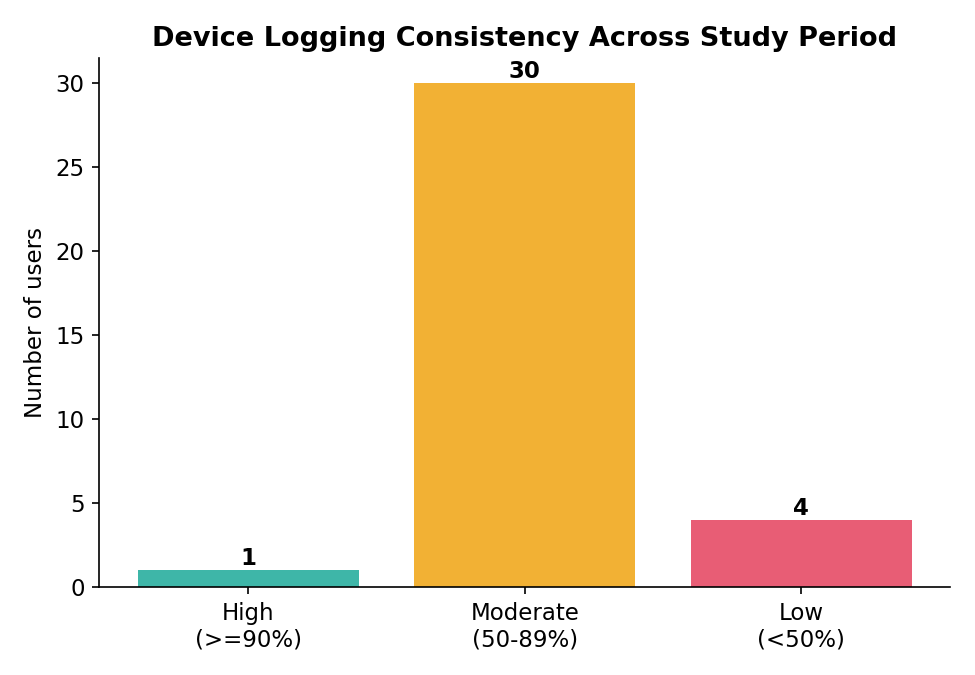

# 🌿 Bellabeat Case Study: How Can a Wellness Company Play It Smart?

A data analytics case study exploring smart-device fitness-tracker usage trends and translating them into marketing strategy recommendations for **Bellabeat**, a high-tech manufacturer of health-focused smart products for women.

> Google Data Analytics Capstone Project — Ask, Prepare, Process, Analyze, Share, Act

---

## 📌 Business Task

Bellabeat cofounder Urška Sršen wants to understand how consumers use **non-Bellabeat smart devices**, then apply those insights to guide marketing strategy for one Bellabeat product.

**Guiding questions:**
1. What are some trends in smart device usage?
2. How could these trends apply to Bellabeat customers?
3. How could these trends help influence Bellabeat's marketing strategy?

**Product in focus:** Bellabeat **Leaf** (activity/sleep/stress tracker) and **Time** (wellness watch) — the two products whose feature set most closely matches the available data (activity, sleep, heart rate, weight).

---

## 📂 Data Source

[FitBit Fitness Tracker Data](https://www.kaggle.com/datasets/arashnic/fitbit) (Kaggle, made available through Mobius) — `CC0: Public Domain`

Thirty-plus Fitbit users consented to share personal tracker data — including minute-level activity, heart rate, and sleep — generated between **March 12 and May 12, 2016**.

| File | Rows | Unique Users | Date Range | Grain |
|---|---|---|---|---|
| `dailyActivity_merged.csv` | 1,397 | 35 | Mar 12 – May 12, 2016 | 1 row / user / day |
| `sleepDay_merged.csv` | 413 | 24 | Apr 12 – May 12, 2016 | 1 row / user / sleep session |
| `heartrate_seconds_merged.csv` | 1,048,575 | 13 | Mar 29 – Apr 12, 2016 | 1 row / 5-second reading |
| `weightLogInfo_merged.csv` | 100 | 13 | Mar 30 – May 9, 2016 | 1 row / weigh-in |

### Credibility (ROCCC)
- ❌ **Reliable / Representative** — self-selected sample of ~35 users, no demographic data (age, gender, location); Bellabeat's core audience is women, but sex isn't recorded here.
- ❌ **Current** — collected in 2016; wearable habits and devices have changed since.
- ✅ **Citable / Original** — sourced via Mobius from consenting Fitbit users, distributed as public domain.
- ⚠️ **Third-party data** — not first-party Bellabeat data; treat findings as directional, and validate against Bellabeat's own user data before acting on them at scale.

---

## 🧹 Data Cleaning & Processing

Processed in **Python (pandas)** — chosen over spreadsheets mainly because `heartrate_seconds_merged.csv` alone has 1M+ rows, impractical to clean reliably by hand.

- Converted all date/time fields to proper datetime types; derived a `Weekday` field.
- Removed 9 "device not worn" rows (0 steps **and** 0 calories) from daily activity.
- Removed 3 duplicate rows from `sleepDay_merged.csv`.
- Inner-joined daily activity with sleep on `Id` + date → 421 matched user-days across 24 users.
- Aggregated heart-rate seconds data to **hourly averages** per hour-of-day.
- Categorized users by average daily steps: Sedentary (<5,000) / Lightly Active (5,000–7,499) / Fairly Active (7,500–9,999) / Very Active (10,000+), per CDC step bands.
- Calculated each user's logging frequency (days logged ÷ 62-day study window) to gauge device engagement.
- Dropped `Fat` column from weight data (96 of 100 rows missing).

---

## 📊 Key Findings

**35** unique users (activity) · **68.7%** of the day spent sedentary · **44%** of nights under 7 hrs sleep · **31 / 35** users log <90% of days

### 1. Most users are moderately active, not sedentary by choice


17 of 35 users qualify as Fairly Active or Very Active by average daily steps; 12 are Sedentary. Bellabeat's audience isn't uniformly low-activity — there's a real segment already motivated to move, plus a sedentary group that likely needs gentler, habit-building prompts.

### 2. Sedentary time dominates the day — even for active users


On an average day, users spend ~990 minutes (69%) sedentary vs. just 20 minutes Very Active. High step counts and long sitting stretches aren't mutually exclusive — the biggest opportunity is breaking up sitting time, not just chasing step totals.

### 3. Steps and intensity drive calories more than sedentary time


Correlation with calories burned: steps **r = 0.58**, very-active minutes **r = 0.59**, sedentary minutes **r = -0.04**. Short bursts of higher-intensity movement move the needle more than logging more sedentary "awake" time.

### 4. More sedentary time is associated with less sleep


Sedentary minutes and same-night sleep duration are negatively correlated (**r = -0.54**); very-active minutes showed almost no relationship (r = -0.09). Prolonged inactivity — not lack of exercise — tracks most with poorer sleep here.

### 5. Sleep is inconsistent, and users lose real time "awake in bed"


Users average 419 minutes (~7.0 hrs) asleep, but 44% of nights fall short of 7 hours, and ~39 minutes/night are spent awake in bed. Sleep *quality* — not just duration — looks like an underused hook.

### 6. Weekday patterns: activity dips midweek and on Sunday


Saturday shows the highest average steps (~7,830); Sunday the lowest (~6,640). Weekday sedentary minutes stay consistently high (947–1,030 min), reflecting desk-bound routines.

### 7. Heart rate rises through the day, peaking in early evening


Resting heart rate is lowest overnight, climbing to peak in the early evening before tapering toward bedtime — a natural window for timing activity or stress nudges.

### 8. Engagement drops off over time


Only 1 of 35 users logged activity on 90%+ of study days; the sample shrinks from 35 (activity) to just 13 users for weight and heart rate. Retention — not just initial adoption — is where a subscription membership model can add the most value.

---

## 🎯 Recommendations

1. **Sell "sitting less," not just "stepping more."** Lead with hourly stand/stretch nudges and frame reduced sitting as a sleep and energy benefit, not only a fitness metric.
2. **Position sleep quality, not just sleep tracking, as a core Bellabeat value.** Offer wind-down coaching, bedtime-consistency streaks, and heart-rate-informed "ready for bed" alerts.
3. **Design specifically for re-engagement, and market membership around it.** Weekly personalized recaps and day-of-week-aware reminders (movement prompts midweek, lighter tone on Sundays), with the Bellabeat membership program as the retention lever.

### ⚠️ Limitations
- Small, dated (2016), non-representative sample with no gender data — validate directionally against Bellabeat's own first-party data before finalizing campaigns.
- Weight and heart-rate conclusions rest on only 13 users each — treat as hypotheses to test, not settled facts.
- Consider pairing with a current, larger dataset (e.g., anonymized Bellabeat app usage) before scaling any campaign.

---

## 🛠️ Tools Used

- **Python** (pandas) — data cleaning, joining, aggregation, correlation analysis
- **Matplotlib** — data visualization
- **Word / docx** — final stakeholder-ready report

## 📁 Repository Structure

```
├── README.md
├── data/                        # raw CSVs (dailyActivity, sleepDay, heartrate, weightLog)
├── images/                      # exported chart visuals
├── Bellabeat_Case_Study_Analysis.docx   # full written report
└── scripts/                     # cleaning + analysis + viz scripts
```

## 📄 Full Report

See [`Bellabeat_Case_Study_Analysis.docx`](./Bellabeat_Case_Study_Analysis.docx) for the complete write-up, including the full Ask/Prepare/Process/Analyze/Share/Act breakdown and detailed methodology notes.

---

*This case study was completed as a portfolio project based on the Google Data Analytics Capstone: Bellabeat case study prompt. Data licensed CC0: Public Domain via Kaggle/Mobius.*